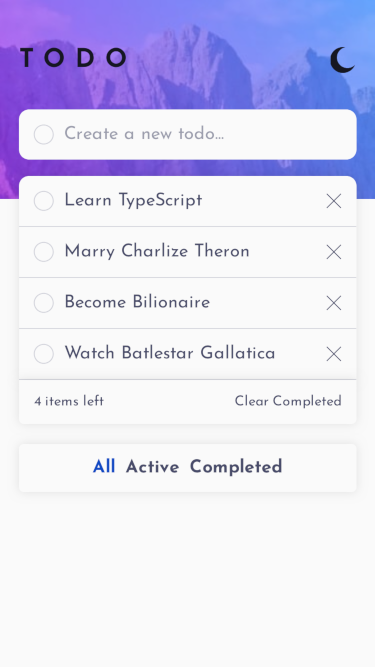
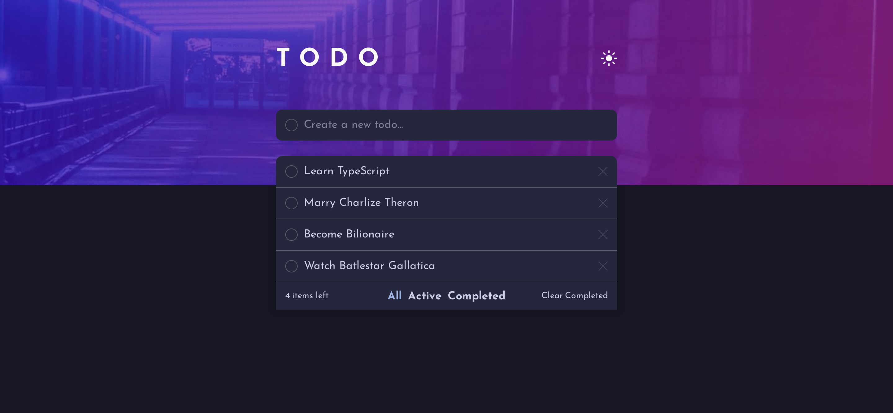

# Todo List

Todo application built with React and TypeScript, featuring task management, theme switching and accessible interactions.

🔗 **Live Demo:** https://awsome-todo-app.netlify.app

---

## 🚀 Key Features

* Add, complete and delete tasks
* Filter tasks (all / active / completed)
* Clear completed tasks
* Light/Dark theme toggle
* System theme detection via `prefers-color-scheme`
* Persistent state using localStorage

---

## 🛠️ Tech Stack

* React
* TypeScript
* CSS (Flexbox)
* LocalStorage API

---

## ♿ Accessibility

Accessibility was implemented with focus on real user interaction.

### ✔️ Implemented

* Full keyboard navigation
* Focus management
* ARIA for dynamic updates
* Accessible state announcements (aria-live)

### 🧪 Tested with

* Orca screen reader (Firefox on Linux)
* WAVE
* IBM Equal Access
* Firefox Accessibility Tools

---

## 🎨 UI / UX Notes

* Theme toggle with persistence (localStorage)
* Initial theme based on user's system preference
* Clear visual states for active filters and tasks

---

## 📸 Preview

| Mobile Light | Desktop Dark |
|-----------------------|--------------------------|
|  |  |

---

## 🧠 Notes

This project was built as part of a Frontend Mentor challenge, with additional focus on:

* Practicing TypeScript in interactive UI scenarios
* Implementing accessible state changes in dynamic lists
* Managing UI state and persistence

---

## 📫 Contact

* LinkedIn: https://www.linkedin.com/in/pedrobfernandes
